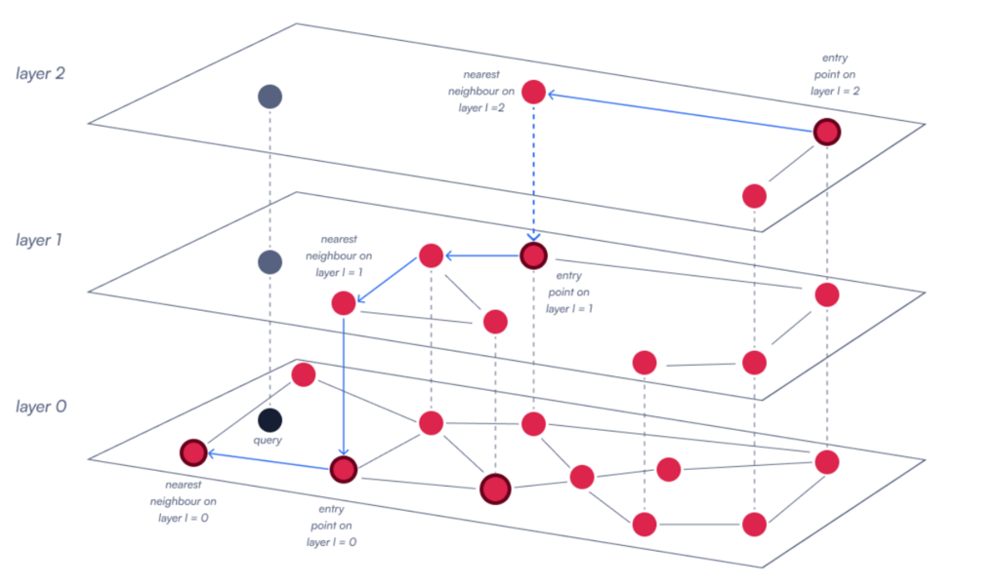
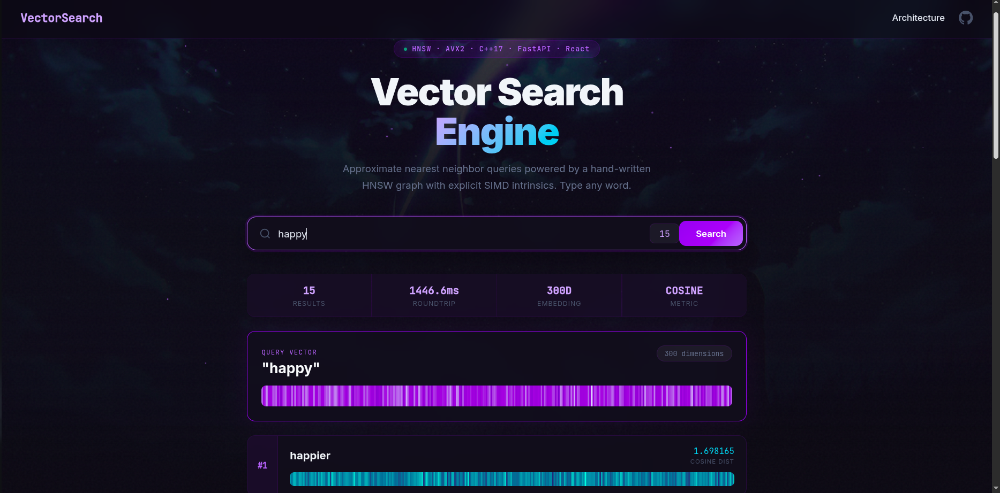
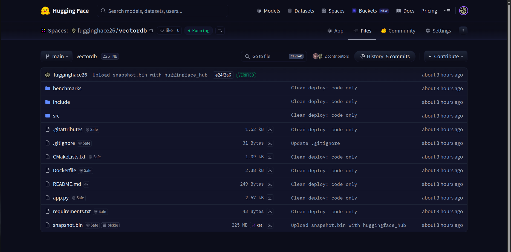
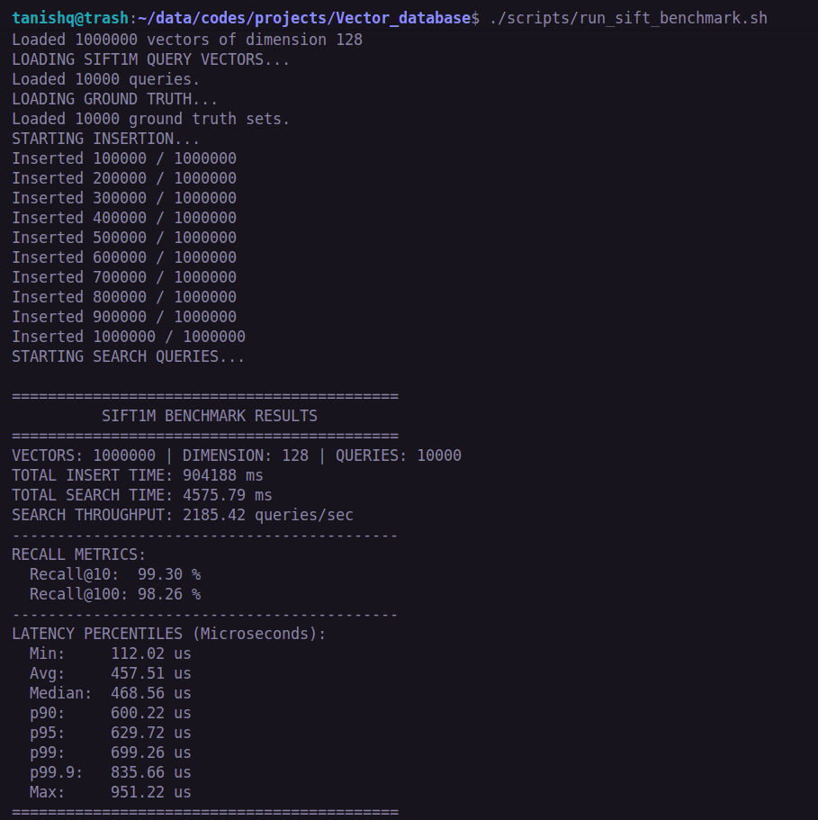

# High-Performance HNSW Vector Database & Semantic Search Engine

An exact-search and Approximate Nearest Neighbor (ANN) vector database engineered entirely in C++ from the ground up, seamlessly bridged into a production-ready Python/FastAPI backend and a React interactive frontend. The core engine is optimized for low-latency memory access using pre-allocated memory arenas and explicit AVX2 SIMD intrinsics, guaranteeing $O(1)$ allocation behavior on the hot path.

## Core C++ Architecture (Engine)

### Memory Layout & Alignment
The core data structure abandons conventional `std::vector` nesting in favor of mathematically flattened 1D arrays (`flat_vectors` and `flat_edges`) mapped against a custom 64-byte `AlignedAllocator`. This strict contiguous memory model minimizes L1/L2 CPU cache misses, eliminates pointer-chasing during graph traversal, and optimizes memory bandwidth. By pre-allocating an arena, vector insertions avoid $O(N)$ capacity reallocations.

### SIMD Acceleration
Distance metrics (L2, Dot Product, Cosine) execute raw hardware-level vectorization via AVX2 Fused Multiply-Add (FMA) intrinsics (`_mm256_fmadd_ps`). By processing 8 floating-point variables per clock cycle and explicitly bypassing conservative compiler heuristics, similarity lookups maintain dense throughput.

### HNSW Graph Topology



The approximate nearest neighbor component is a multi-layer Navigable Small World graph, designed for extreme low-latency logarithmic search paths.

* **$M$**: `32` (Denser intermediate layer connections)
* **$M_{max0}$**: `64` (Denser base layer capacity)
* **$ef_{construction}$**: `400` (High-quality graph build)
* **$ef_{search}$**: `200` (Wide search beam during inference)

## Full-Stack Semantic Search Architecture



Building upon the C++ engine, the project implements a complete, distributed full-stack application:

### Embedding Layer (FastText)
Semantic embeddings are generated on-the-fly using Facebook's pre-trained **FastText** (`cc.en.300`). Because FastText relies on character n-gram subwords, it natively solves the Out-of-Vocabulary (OOV) problem, robustly handling misspellings and novel words without throwing errors.

### Python Bindings (pybind11)
The native C++ Engine, `SearchResult` structures, and metric enums are exposed to Python via a compiled `pybind11` shared library. It uses zero-copy STL conversions to rapidly pass 300-dimensional floating-point arrays between Python and C++ memory spaces.

### FastAPI Backend & Filtering
The backend is driven by an asynchronous **FastAPI** server running on Uvicorn. When a query is received, it extracts the target vector, queries the C++ engine, and then applies a **Levenshtein distance filter** to discard morphologically identical results (e.g., "king" and "kings"), ensuring diverse semantic results. The HNSW graph state is persisted to disk via a highly optimized binary serialization protocol (`snapshot.bin`) for rapid cold-starts.

### Production Deployment


* **Backend:** Dockerized and deployed on **Hugging Face Spaces** (leveraging their 16GB RAM free tier to hold the 7GB FastText model in memory). The model itself is pulled directly from Facebook's CDN during the Docker build stage to circumvent repository size limits.
* **Frontend:** Hosted globally on **Vercel's Edge Network**.

## Benchmarks (Core Engine)

The system was benchmarked against the standard **SIFT1M** dataset (1,000,000 base vectors, 128 dimensions).

| Metric | Result |
| :--- | :--- |
| **Recall@10** | 99.30% |
| **Recall@100** | 98.26% |
| **Throughput** | 2,215 Queries/Second |
| **P99 Latency** | 654 microseconds |
| **Build Time** | ~13 minutes |



## Project Structure

```text
vector_database/
├── CMakeLists.txt           # Build configuration for core engine and pybind11
├── Dockerfile               # Multi-stage production deployment configuration
├── app.py                   # FastAPI backend and Levenshtein filtering logic
├── frontend/                # React 18 + Vite UI, Vector Canvas, Architecture views
├── include/                 # C++ Headers (Engine, Allocators, SIMD Metrics)
├── src/
│   ├── database.cpp         # HNSW implementations and core traversal logic
│   ├── Save_file.cpp        # Disk serialization routines
│   └── bindings.cpp         # Pybind11 Python ↔ C++ bridge
└── benchmarks/
    └── sift_benchmark.cpp   # SIFT1M evaluation
```

## Quick Start (Local Full-Stack)

1. **Build the C++ Engine / Python Bindings**
   ```bash
   mkdir build && cd build
   cmake -DCMAKE_BUILD_TYPE=Release ..
   make -j$(nproc)
   ```
2. **Start the Backend**
   Download `cc.en.300.bin` into the root directory, then run:
   ```bash
   pip install -r requirements.txt
   uvicorn app:app --host 0.0.0.0 --port 8000
   ```
3. **Start the Frontend**
   ```bash
   cd frontend
   npm install
   npm run dev
   ```

## Automated C++ Benchmark
To evaluate raw performance, execute the automated benchmarking script (downloads the 150MB SIFT1M dataset, compiles with AVX2, and executes):
```bash
chmod +x scripts/run_sift_benchmark.sh
./scripts/run_sift_benchmark.sh
```
