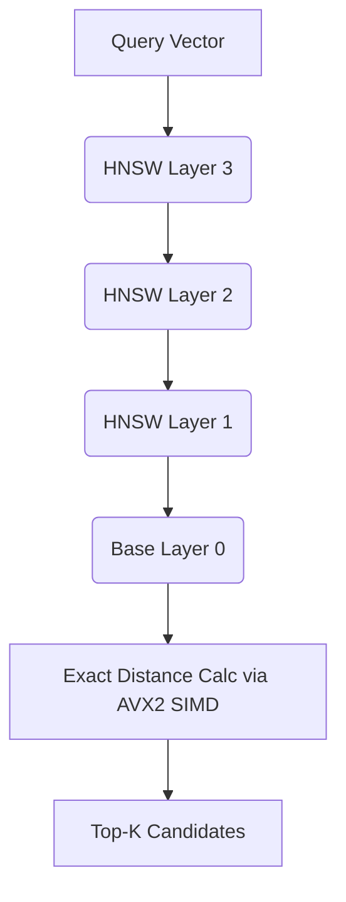

# C++ Vector Database (HNSW-ANN)

An exact-search vector database optimized for low-latency memory access, subsequently upgraded with a multi-layer Hierarchical Navigable Small World (HNSW) Approximate Nearest Neighbor (ANN) index. Engineered with pre-allocated memory arenas and explicit AVX2 intrinsics, the system bypasses heap fragmentation and guarantees $O(1)$ allocation behavior on the hot path.

## Architecture & Design

### Memory Layout & Alignment
The core data structure abandons conventional `std::vector` nesting in favor of mathematically flattened 1D arrays (`flat_vectors` and `flat_edges`) mapped against a custom 64-byte `AlignedAllocator`. This strict contiguous memory model minimizes L1/L2 CPU cache misses, eliminates pointer-chasing during graph traversal, and optimizes memory bandwidth. By pre-allocating an arena, vector insertions avoid $O(N)$ capacity reallocations.

### SIMD Acceleration
Distance metrics (L2, Dot Product, Cosine) execute raw hardware-level vectorization via AVX2 Fused Multiply-Add (FMA) intrinsics (`_mm256_fmadd_ps`). By processing 8 floating-point variables per clock cycle and explicitly bypassing conservative compiler heuristics, similarity lookups maintain dense throughput.

### HNSW Graph Topology
The approximate nearest neighbor component is a multi-layer Navigable Small World graph, designed for extreme low-latency logarithmic search paths.


* **$M$**: `32` (Denser intermediate layer connections)
* **$M_{max0}$**: `64` (Denser base layer capacity)
* **$ef_{construction}$**: `400` (High-quality graph build)
* **$ef_{search}$**: `200` (Wide search beam during inference)



## Benchmarks

The system was benchmarked against the standard **SIFT1M** dataset (1,000,000 base vectors, 128 dimensions).

| Metric | Result |
| :--- | :--- |
| **Recall@10** | 99.30% |
| **Recall@100** | 98.26% |
| **Throughput** | 2,215 Queries/Second |
| **P99 Latency** | 654 microseconds |
| **Build Time** | ~13 minutes |

## Project Structure

```text
vector_database/
├── CMakeLists.txt
├── README.md
├── include/
│   └── database.hpp         # Class definitions and configurations
├── src/
│   ├── database.cpp         # HNSW implementations and core logic
│   └── Save_file.cpp        # Disk serialization routines
├── benchmarks/
│   └── sift_benchmark.cpp   # SIFT1M benchmark evaluation implementation
└── scripts/
    └── run_sift_benchmark.sh # Automates dataset download, build, and benchmark execution
```

## Quick Start (Automated Shell)

The easiest way to evaluate the system is using the automated benchmarking script. It will automatically download the ~150MB SIFT1M `.tar.gz` dataset from the INRIA FTP server (if not present), compile using exact AVX2 flags, and execute the benchmark natively.

```bash
chmod +x scripts/run_sift_benchmark.sh
./scripts/run_sift_benchmark.sh
```

## Quick Start (CMake)

Alternatively, you can manually build the executable via CMake:

```bash
# 1. First ensure the SIFT dataset is downloaded
# (e.g. via wget ftp://ftp.irisa.fr/local/texmex/corpus/sift.tar.gz and extracting to the root sift/ directory)

# 2. Build the project via CMake
mkdir build && cd build
cmake -DCMAKE_BUILD_TYPE=Release ..
make -j$(nproc)

# 3. Execute the benchmark
./sift_benchmark
```